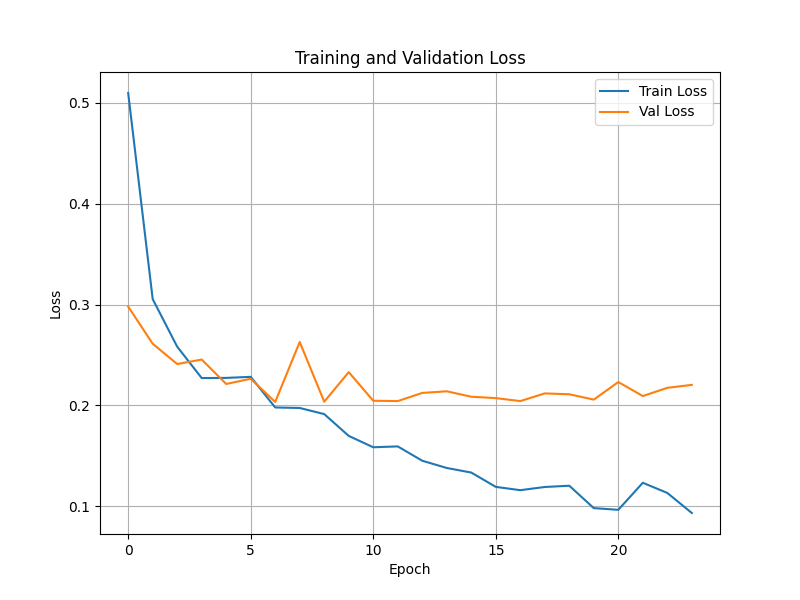

# 🧥 Fashion MNIST Classifier

This project is a PyTorch-based image classifier for the Fashion MNIST dataset using a RegNetY architecture from the [timm](https://github.com/huggingface/pytorch-image-models) library. It leverages Albumentations for image preprocessing and visualizes training and validation loss.

> 📦 Dataset used: [Fashion MNIST PNG Dataset on Kaggle](https://www.kaggle.com/datasets/andhikawb/fashion-mnist-png)  
> 🧠 Model: `regnety_006` from `timm`

---

## 📊 Sample Loss Plot

After training, the script will save the following plot to `assets/loss_plot.png`:

<p align="center">
  
</p>

---

## 🚀 Installation

1. **Clone the repository**

   ```bash
   git clone https://github.com/anto18671/vision-classifier.git
   cd vision-classifier
   ```

2. **Create a virtual environment (optional but recommended)**

   ```bash
   python -m venv venv
   source venv/bin/activate  # or venv\Scripts\activate on Windows
   ```

3. **Install dependencies**

   ```bash
   pip install -r requirements.txt
   ```

---

## 📁 Dataset Structure

Download and unzip [this dataset](https://www.kaggle.com/datasets/andhikawb/fashion-mnist-png) into the `data/` folder, so that it looks like:

```
vision-classifier/
│
├── data/
│   ├── train/
│   │   ├── 0/
│   │   ├── 1/
│   │   └── ...
│   └── val/
│       ├── 0/
│       ├── 1/
│       └── ...
```

---

## 🏁 Run the Training

Simply run:

```bash
python train.py
```

This will:

- Train the model for 24 epochs
- Save the training/validation loss plot to `assets/loss_plot.png`

---

## 📦 Requirements

Minimal `requirements.txt`:

```
torch
torchvision
timm
albumentations
opencv-python
matplotlib
tqdm
```

You can create this file with:

```bash
pip freeze > requirements.txt
```

---

## 📄 License

MIT License — see [LICENSE](https://github.com/anto18671/vision-classifier/blob/main/LICENSE)
